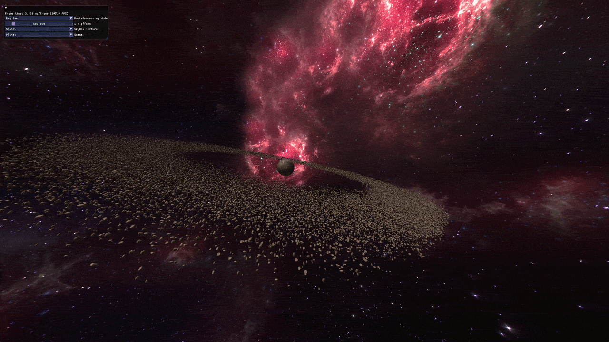
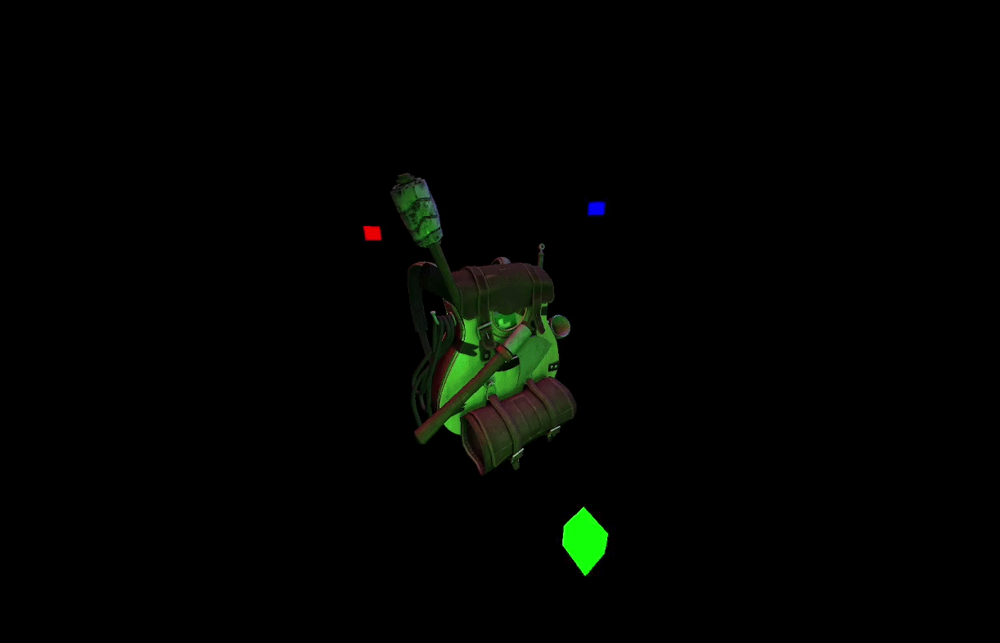
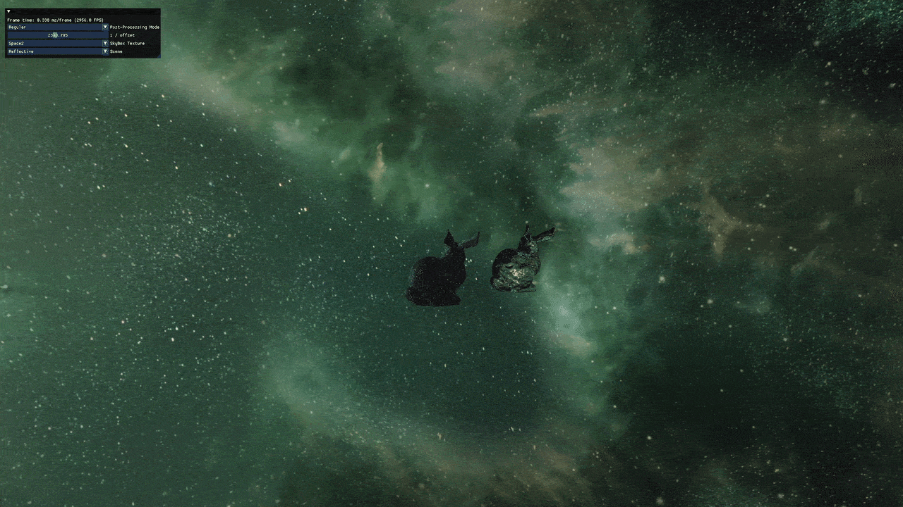
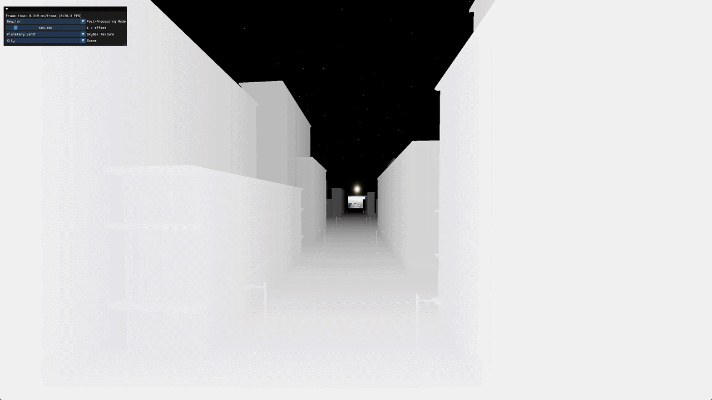
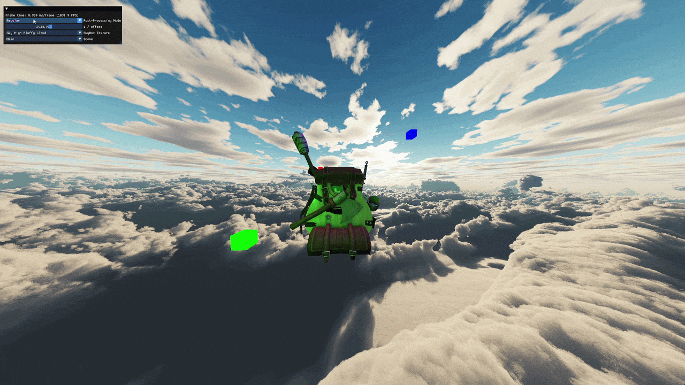

# OpenGL Renderer

A real-time renderer written in C++ using modern OpenGL. This project began as a way to learn the graphics pipeline beyond the basics and has gradually grown into a reusable rendering framework. Rather than relying on an existing game engine, the focus is on implementing common rendering techniques directly with OpenGL and understanding how they work.

The project is organized around reusable components such as models, meshes, materials, shaders, textures, scenes, and a renderer, making it easy to experiment with new rendering techniques while keeping the codebase manageable.

---

## Features

### Rendering

- OpenGL rendering pipeline
- Blinn-Phong lighting model
- Directional, point, and spot lights
- Instanced rendering
- Skyboxes
- Cubemap reflections and refractions
- Normal mapping
- Shadow mapping with simple percentage closer filtering (PCF)

### Materials

- Diffuse, specular, and normal textures
- Texture scaling
- Material abstraction for managing shaders and textures
- Support for imported model materials

### Model Loading

- Assimp integration
- Use of Assimp to import model which are converted into custom Model format that can be rendered with the above pipleline

### Post Processing

- Framebuffer rendering
- Convolution filters for viusual effects
- Gamma Correction

### User Interface

- Dear ImGui integration
- Runtime scene selection
- Rendering options and debugging controls

---

## Libraries

- OpenGL 4.6
- GLFW
- GLAD
- GLM
- Assimp
- stb_image
- Dear ImGui

---

## Project Structure

```
Renderer
│
├── Scene
├── SceneObject
├── Model
├── Mesh
├── Material
├── Texture
├── Shader
├── Camera
├── Framebuffer
└── Resources
```

Each scene is responsible for creating and updating objects, while the renderer handles all the drawing calls. Materials define how the surface of a model will look including any textures or material specific data that needs to be uploaded to the GPU. This allows models to be rendered without scene or material specific rendering logic.

---

## Examples







---

## Building

### Requirements

The project is currently developed and tested on:

- Windows 11
- Visual Studio 2026
- OpenGL 4.6

Some third party dependencies (such as the Assimp DLL) may need to be installed or copied into the executable directory before running. Some textures and models used are not included due to their size.

---

## Future Work

Some features planned for future versions include:

- Physically Based Rendering (PBR)
- Image Based Lighting (IBL)
- Omnidirectional shadow mapping
- Deferred shading
- HDR
- Bloom
- SSAO
- Particle System
- Terrain Generation
- Parallax Mapping

---

## Motivation

This project is mainly a learning project focused on graphics programming. The goal is to gain a better understanding of real time rendering by implementing common graphics techniques directly rather than relying on an existing game engine.